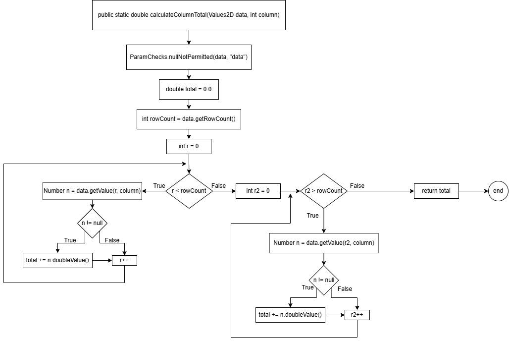
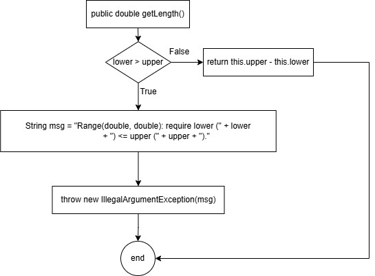

**SENG 438 - Software Testing, Reliability, and Quality**

**Lab. Report #3 – Code Coverage, Adequacy Criteria and Test Case Correlation**

| Group: 5      |
|-----------------|
| Mohammed Zaid Shaikh   |
| Alexander Lai          |
| Odin Fox               |
| Aidan Gaede-Janke      |

(Note that some labs require individual reports while others require one report
for each group. Please see each lab document for details.)

# 1 Introduction

This lab report tests the coverage ranges of our previous lab report using EclEmma. The coverage tool allowed us to enhance our unit tests to gain better control flow coverage (for branch, condition, and statement). In addition, this lab covers two data flow graphs to show the data flow coverage of the calculateColumnTotal and getLength methods.

Our goal in this lab included creating more enhanced unit test cases to incerase covergae and create data flow graphs to identify def-use pairs.

# 2 Manual data-flow coverage calculations for X and Y methods

**calculateColumnTotal:**

**Def Use Sets:**

|  Line #    | Code      |  DU      |
| ----- | ----------------------------------------------------------------------- | ------------------------------------------- |
| 1     | public static double calculateColumnTotal(Values2D data, int column)    | def = data, columnc-use = nullp-use = null  |
| 2     | ParamChecks.nullNotPermitted(data, "data")                              | def = nullc-use = datap-use = null          |
| 3     | double total = 0.0                                                      | def = totalc-use = nullp-use = null         |
| 4     | int rowCount = data.getRowCount()                                       | def = rowCountc-use = datap-use = null      |
| 5     | for (int r = 0; r &lt; rowCount; r++)                                   | def = rc-use = rp-use = r, rowCount         |
| 6     | Number n = data.getValue(r, column)                                     | def = nc-use = data, r, columnp-use = null  |
| 7     | if (n != null)                                                          | def = nullc-use = nullp-use = n             |
| 8     | total += n.doubleValue()                                                | def = totalc-use = total, np-use = null     |
| 11    | for (int r2 = 0; r2 > rowCount; r2++)                                   | def = r2c-use = r2p-use = r2, rowCount      |
| 12    | Number n = data.getValue(r2, column)                                    | def = nc-use = data, r2, columnp-use = null |
| 13    | if (n != null)                                                          | def = nullc-use = nullp-use = n             |
| 14    | total += n.doubleValue()                                                | def = totalc-use = total, np-use = null     |
| 17    | return total                                                            | def = nullc-use = totalp-use = null         |

**DU Pairs:**

| Variables    |  Lines       |  Def Lines   |     DU Pairs                                           |
| ------------ | ------------ | ------------ | ------------------------------------------------------ |
| r            | 5, 6         | 5            | {5,5}{5,6}                                             |
| n            | 7, 8, 13, 14 | 6, 12        | {6,7}{6,8}{6,13}{6,14}{12,7}{12,8}{12,13}{12,14}       |
| r2           | 11, 12       | 11           | {11,11}{11,12}                                         |
| data         | 2, 4, 6, 12  | 1            | {1,2}{1,4}{1,6}{1,12}                                  |
| column       | 6, 12        | 1            | {1,6}{1,12}                                            |
| total        | 8, 14, 17    | 3, 8, 14     | {3,8}{3,14}{3,17}{8,8}{8,14}{8,17}{14,8}{14,14}{14,17} |
| rowCount     | 5, 11        | 4            | {4,5}{4,11}                                            |

**getLength:**

**Def Use Sets:**

|  Line #    | Code      |  DU      |
| ----- | ---------------------------------------------------------------- | ----------------------------------------------------- |
| 1     | public double getLength()                                        | def = nullc-use = nullp-use = null                    |
| 2     | if (lower > upper)                                               | def = nullc-use = nullp-use = lower, upper            |
| 3     | String msg = "Range(double, double): require lower (" + lower+ ") <= upper (" + upper + ")."| def = msgc-use = lower, upper, msgp-use = null         |
| 4     | throw new IllegalArgumentException(msg)                          | def = nullc-use = msgp-use = null                     |
| 5     | return this.upper - this.lower                                   | def = nullc-use = this.lower, this.upperp-use = null  |

**DU Pairs:**

| Variables    |  Lines       |  Def Lines   |     DU Pairs      |
| ------------ | ------------ | ------------ | ----------------- |
| msg          | 4            | 3            | {3,4}             |

# 3 A detailed description of the testing strategy for the new unit test

Text…

# 4 A high level description of five selected test cases you have designed using coverage information, and how they have increased code coverage

Text…

# 5 A detailed report of the coverage achieved of each class and method (a screen shot from the code cover results in green and red color would suffice)

Text…

# 6 Pros and Cons of coverage tools used and Metrics you report

Text…

# 7 A comparison on the advantages and disadvantages of requirements-based test generation and coverage-based test generation.

Text…

# 8 A discussion on how the team work/effort was divided and managed

Text…

# 9 Any difficulties encountered, challenges overcome, and lessons learned from performing the lab

Text…

# 10 Comments/feedback on the lab itself

Text…
